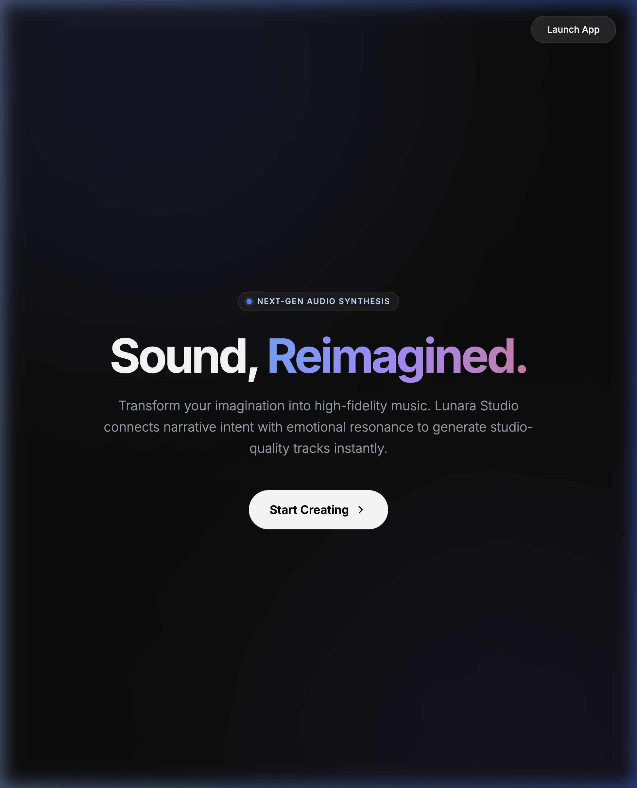
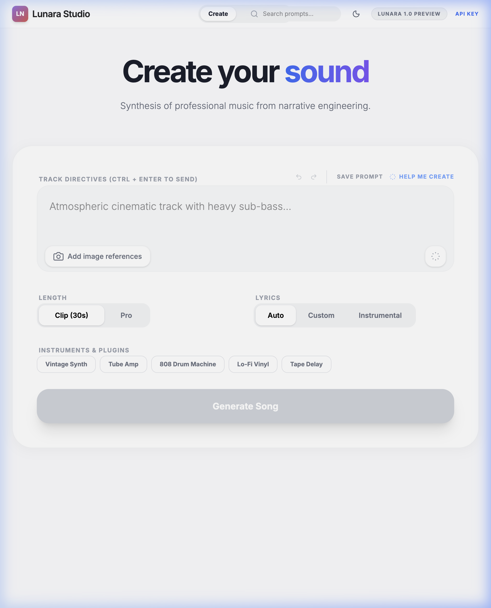
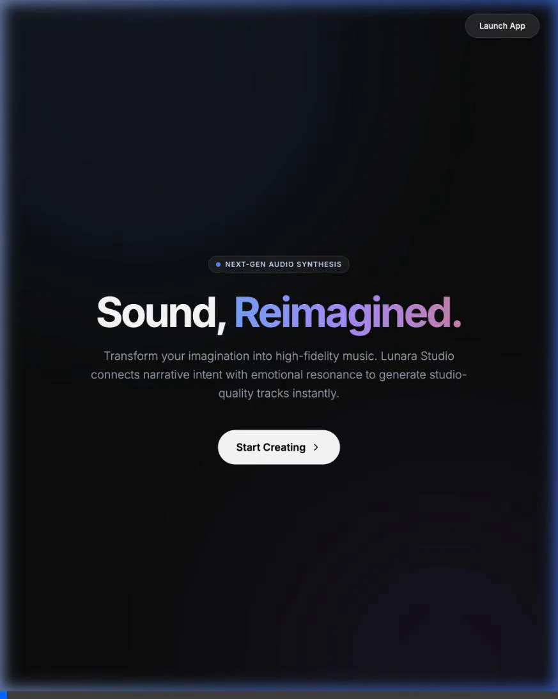

<div align="center">

<br />


<br /><br />

```text
 ██╗     ██╗   ██╗███╗   ██╗█████╗ ██████╗  █████╗ 
 ██║     ██║   ██║████╗  ██║██╔══╝ ██╔══██╗██╔══██╗
 ██║     ██║   ██║██╔██╗ ██║██████╗██████╔╝███████║
 ██║     ██║   ██║██║╚██╗██║██╔═══╝██╔══██╗██╔══██║
 ███████╗╚██████╔╝██║ ╚████║██║    ██║  ██║██║  ██║
 ╚══════╝ ╚═════╝ ╚═╝  ╚═══╝╚═╝    ╚═╝  ╚═╝╚═╝  ╚═╝
```

### **Lunara Studio** — Tek Arayüz. Sınırsız Melodi. Yapay Zekayla Profesyonel Müzik Üretimi.

**Yapay zeka ses motoru** · Canlı görselleştirme · Katmanlı kompozisyonlar · Tek tıklamayla video ihracı.

[🚀 Canlı Demo](https://lunara-studio-liard.vercel.app/) · [⚡ Gemini AI](https://deepmind.google/technologies/gemini/) · [☁️ Vercel](https://vercel.com)

</div>

---

## ✦ Genel Bakış (Overview)

**Lunara Studio**, yapay zeka destekli müzik üretim sürecinizi baştan sona kolaylaştıran, zengin tasarıma sahip gelişmiş bir prompt oluşturucu ve görselleştirme platformudur. Yapay zeka müzik üreticileri için mükemmel melodi ve tınıyı yakalamak genellikle karmaşık denemeler gerektirir; Lunara bu noktada devreye girerek yapılandırılmış ve ilham verici bir iş akışı sunar.

Prompt fikirlerinizi not defterlerinde saklamayı bırakın. Lunara ile dinamik şarkı yönergeleri oluşturabilir, Gemini AI destekli prompt önerileri alabilir, geçmiş fikirlerinizi geri alıp/yineleyebilir (undo/redo), şarkılarınızı sıraya ekleyebilir, albümler halinde gruplayabilir ve ürettiğiniz müzikleri dalga formları (waveform) veya parçacık (particle) efektleriyle özelleştirilmiş videolar olarak dışa aktarabilirsiniz.

---

## ✦ English Description

**Lunara Studio** is a next-generation AI music generation helper, prompt engineer, and interactive visualization platform. Crafting the perfect prompt for audio models can be a chaotic process. Lunara streamlines this journey by providing an elegant, feature-rich interface to build prompts, get AI-powered recommendations, manage generation history, queue playback, and export songs into videos with reactive visualizers.

All data, prompt history, and user settings are kept locally, ensuring absolute privacy while allowing seamless integration with the Google Gemini API for creative prompts and high-fidelity audio output.

---

<div align="center">


</div>

---

## ⚡ Öne Çıkan Özellikler (Features)

| Özellik | Açıklama |
|--------|----------|
| 🎛️ **Prompt Builder** | Moods, genres, themes, BPM ve Scales içeren yapay zekaya uygun yönerge yapıcı. |
| 🤖 **Gemini AI Önerileri** | Seçtiğiniz müzik özelliklerine göre en iyi promptu üreten Gemini destekli öneri motoru. |
| 🎥 **Video Dışa Aktarım** | Waveform, Bars ve Particle görselleştiricileriyle audio dosyalarını doğrudan WebM olarak kaydetme. |
| 🕰️ **Undo/Redo & Geçmiş** | Prompt değişikliklerinde sınırsız geri alma/yineleme ve yerel otomatik kaydetme desteği. |
| 🎵 **Gelişmiş Oynatma Kuyruğu** | Üretilen parçaları kuyruğa ekleme, sürükleme, sıralama ve kesintisiz arka arkaya dinleme. |
| 🎹 **MIDI Desteği** | Üretilen şarkının akor şemasını DAW yazılımlarında kullanmak üzere anında `.mid` olarak indirme. |
| 🖼️ **Görsel Bağlam** | Prompt ile birlikte yapay zekaya girdi olarak verilecek referans resimleri yükleme. |
| 🌌 **3D Canlı Görselleştirici** | React Three Fiber tabanlı, çalan müziğin ritmine ve temposuna duyarlı dinamik 3D küre. |

---

<div align="center">

</div>

---

## 🛠️ Teknolojiler (Tech Stack)

```text
Arayüz         →  React 19 (Strict Mode) · TypeScript · Vite 6
Stil           →  Tailwind CSS v4 · Glassmorphism tasarımlar
Yapay Zeka     →  Google GenAI SDK (@google/genai)
Ses Modelleri  →  lyria-3-pro-preview · lyria-3-clip-preview
Görsel Üretim  →  gemini-2.5-flash-image
3D Render      →  Three.js · @react-three/fiber · @react-three/drei
Yerel Depolama →  localStorage (otomatik kayıt & geçmiş)
Yayınlama      →  Vercel (SPA routing desteğiyle)
```

---

## 🔄 Çalışma Mantığı (Data Flow)

```text
                        ┌─ Referans Görseller (Camera API)
  Kullanıcı Girdileri ──▶├─ Prompt Şablonları (Helper Mode)  ──▶  Google GenAI API
                         └─ Özel Akor ve Sözler (Lyrics)         (Model: Lyria-3)
                                                                       │
  Kuyruk & Albüm  ◀── Video/MIDI İhracı · 3D Visualizer ◀──────────────┘
  (Local Storage)     (Canvas / R3F / MediaRecorder)
```

1. **Prompt Hazırlama**: Kullanıcı şablonlar aracılığıyla ya da serbest metin olarak müzik direktiflerini belirler. AI Prompt Suggestion motoruyla alternatifler türetebilir.
2. **Audio & Medya Sentezi**: Google GenAI SDK üzerinden Lyria ses modelleriyle parça oluşturulur. Paralel olarak şarkıya başlık ve 1:1 formatında albüm kapağı oluşturulur.
3. **Müzik Oynatma & Efekt**: Çalan müzikle senkronize olan 3D küre ve dalga boyu analizörleri çalışır.
4. **Kayıt ve İndirme**: Kullanıcı isterse parçayı `.wav` olarak, akorları `.mid` olarak, veya şarkı sözlerinin senkronize aktığı bir karaoke videosunu `.webm` olarak indirebilir.

---

## 📐 Proje Yapısı (Project Structure)

```text
LunaraStudio/
├── src/
│   ├── components/
│   │   ├── PromptBuilder.tsx      # Prompt şablonları oluşturan modül
│   │   ├── ThreeDVisualizer.tsx   # React Three Fiber 3D görselleştirici
│   │   ├── CommunityFeed.tsx      # Topluluk ve Firebase paylaşım ekranı
│   │   └── SongCard.tsx           # Galeri şarkı kartı tasarımı
│   ├── services/
│   │   └── genaiService.ts        # Gemini metin, görsel ve öneri servisleri
│   ├── utils/
│   │   ├── audioUtils.ts          # Base64 ses çözme yardımcıları
│   │   ├── midiUtils.ts           # MIDI dosya yazma ve indirme motoru
│   │   ├── lyricsUtils.ts         # Şarkı sözleri zamanlama ayıklayıcısı
│   │   └── videoUtils.ts          # Canvas tabanlı WebM video kayıt sentezleyici
│   ├── config.ts                  # Lyria model ve arayüz konfigürasyonları
│   └── lib/
│       └── firebase.ts            # Auth & veritabanı istemcisi
├── App.tsx                        # Ana uygulama bileşeni ve durum yönetimi
├── vercel.json                    # SPA yönlendirmeleri için Vercel ayarları
├── package.json                   # Bağımlılıklar ve derleme betikleri
└── index.html                     # Arayüz giriş noktası
```

---

## 🚀 Kurulum ve Çalıştırma (Getting Started)

### Gereksinimler
- Node.js `>= 18`
- Google Gemini API Anahtarı ([Google AI Studio](https://aistudio.google.com/))

```bash
# Projeyi klonlayın
git clone https://github.com/kutluhangil/LunaraStudio.git
cd LunaraStudio

# Bağımlılıkları yükleyin
npm install

# Geliştirme sunucusunu başlatın
npm run dev        # Tarayıcıda açın: http://localhost:3000
```

### Derleme (Build)
```bash
# Production paketini hazırlayın
npm run build

# Yerel olarak test edin
npm run preview
```

---

<div align="center">

Müzisyenler ve içerik üreticileri için ❤️ ile tasarlandı · **[kutluhangil](https://github.com/kutluhangil)**

<br />

*Beğendiyseniz yıldız ⭐ bırakmayı unutmayın.*

</div>
